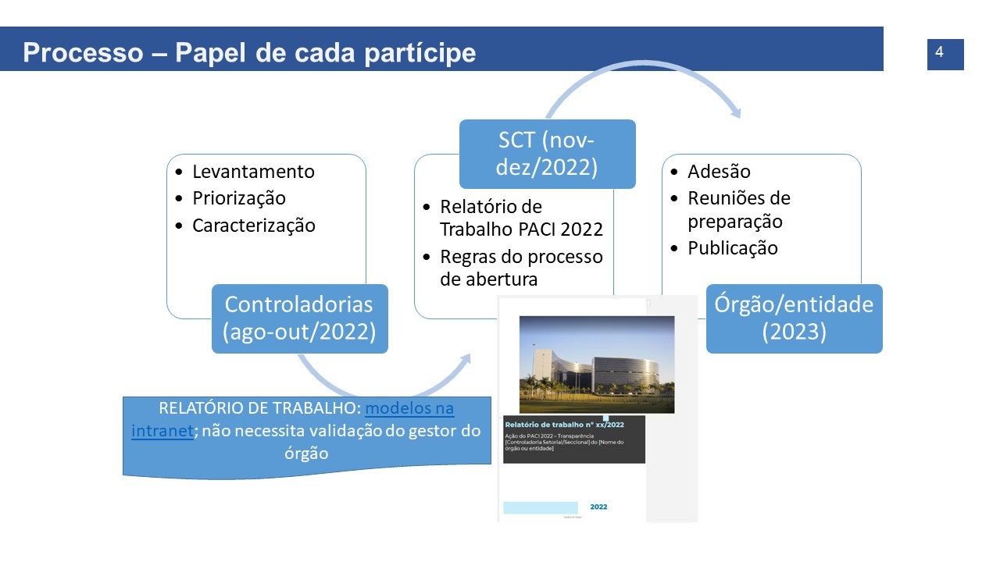

## Feedback: ATENDIMENTO INCIPIENTE

Prezado controlador,

Agradecemos o encaminhamento do Relatório de Trabalho referente à ação de Transparência do PACI 2022, que versava sobre Dados Abertos.  

Essa ação tinha como Objetivo Geral "Fomentar a abertura de dados de interesse público e geral nos órgãos e entidades da Administração Pública Estadual". Tal ação se desdobra em duas etapas:

1. identificação, priorização e caracterização das bases de dados passíves de abertura, pelas Controladorias (CSet/CSec), por meio do relatório de trabalho;

2. avaliação da viabilidade de abertura das bases apresentadas nos relatórios e chamadas para adesão ao processo de publicação, pelo nível central. 

O relatório apresentado por esta Controladoria mostrou que a equipe atendeu o propósito de:

- indicar as bases de dados passíveis de abertura, através dos registros das demandas mais frequentes de transparência passiva / outros canais e meios de comunicação / experiência e julgamento da prórpia equipe;

Entretanto, para que possamos avançar, em nível central, na avaliação de viabilidade de abertura das bases indicadas e priorizadas, será necessário uma avaliação mais detida nos quesitos que não ficaram evidentes no relatório:

- priorização as bases indicadas, de acordo com critérios e ponderações;

- caracterização de alguns elementos-chave das bases.

Estamos escalonando as bases indicadas pelas controladorias de todos órgãos e entidades, para inciarmos o processo de abertura, por adesão dos custodiantes de dados. Aquelas controladorias que demonstraram a caracterização das bases indicadas no relatório, com suficiência, serão priorizadas. Em momento oportuno, retomaremos o contato para planejar o início do processo de adesão à abertura das bases indicadas no seu órgão/entidade, com o acompanhamento desta Controladoria. 

Agradecemos mais uma vez pela conclusão deste trabalho e desejamos um excelente 2023.
